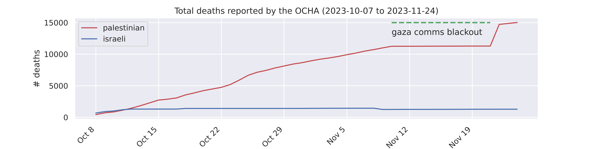
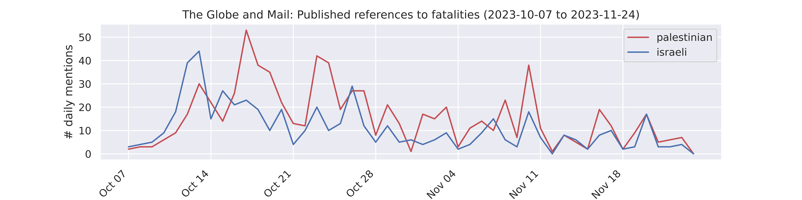
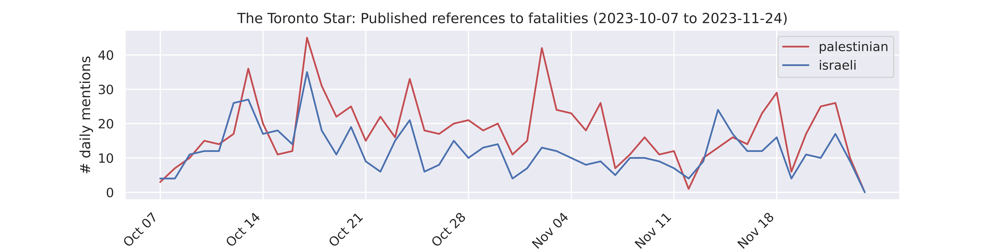
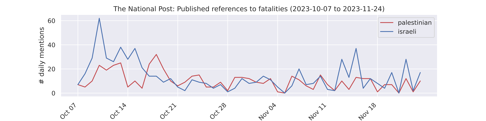

## Quantifying Canadian media coverage of the war on Gaza
This repository contains the code and data for an analysis of anti-Palestinian bias in the Canadian media conducted by [The Breach](https://breachmedia.ca/palestinian-deaths-canadian-newspapers-data/).
This project is heavily indebted to [Holly Jackson](https://github.com/hollyjackson/casualty_mentions_nyt/), who has performed similar analyses of American newspapers.

### **Installation**
This was run on Manjaro Linux (Release 22.0.0) using Python 3.10.8. Dependencies can be installed using `pip`:
```bash
pip3 install -r requirements.txt
```

### **Methods**
**1. Web scraping:** I do not have access to academic newspaper archives or databases, so I used web scraping tools to automatically compile sets of relevant articles published between October 7th and November 28th, 2023. Due to differences in website organization and tag structure, this process was unique for each publication.

- *The Globe and Mail*: All articles posted under the ["Israel-Hamas war"](https://www.theglobeandmail.com/topics/israel-hamas-war/) topic were included.

- *The Toronto Star*: The Star does not have a relevant topic page or user-searchable article tags. The results of text body searches for "Israel," "Hamas," "Gaza," "Palestinian," and "Palestine" were included. Results were narrowed down with a combination of metadata keyword and article title matching. Only articles tagged "Canada," "Middle East," "World," "Politics," "Contributors," "News," or "Opinion" were included.

- *The National Post*: The results of keyword searches for "Israel," "Hamas," "Gaza," "Palestinian," and "Palestine" were included. Only articles tagged "News," "Canada," "NP Comment," "Israel & Middle East," "World," "Canadian Politics," and "Toronto" were included. 

Scripts to replicate scraping are included in `src/` (note that results will vary depending on run date and website changes).
Compiled articles can be found in `data/`.

**2. Sentence extraction:** Once article text was compiled, each sentence of each article was tokenized and lemmatized using `nltk`. Lemmatized verbs were checked for matches to a list of active and passive fatal verbs, and lemmatized nouns were checked for matches to a list of fatal nouns. All sentences with one or more matches were compiled into a dataset for each publication.

Scripts to replicate extraction are included in `src/`.

**3. Sentence labeling:** The Breach manually read every sentence and added two labels. The first indicates the victim in the sentence as "Israeli," "Palestinian," "Both," or "Neither." The second label indicates the perpetrator identified in the sentence as "Israel," "Hamas," "Both," or "Neither." Irrelevant sentences and a small number of sentences containing meaningless metadata/html were manually removed.

Compiled and labeled sentences are included in `data/`.

### **Caveats**
There are three main limitations to this analysis. First, due to idiosyncratic and inconsistent article tags the scraping process was not very principled—especially for the Star and Post, which do not have relevant "topic" pages. Second, the automated tokenization and lemmatization is limited by the `nltk` language models used and the non-exhaustive list of fatal nouns and verbs checked. Finally, due to time and resource contraints articles were resticted to a limited set of tags. It should be assumed that some relevant articles and sentences published by the newspapers were missed. ***As a result, the datasets included in this repository are not an exhaustive archive.*** Considering that over 1000 relevant articles mentioning death were identified, it remains a comprehensive sample.

### **OCHA fatality data**
This repository also includes a dataset including [fatality counts reported by the United Nations Office for the Coordination of Humanitarian Affairs (OCHA)](https://www.ochaopt.org/data/casualties). The numbers are pulled from the daily OCHA "Flash Updates," and are unconfirmed and subject to revision. Fatality counts are frequently revised and are impacted by communications blackouts and fog of war, so this is a time series of reported fatality estimates and not actual fatalities. 



### **Results**
The Breach has published several infographics based on this analysis, but the following figures show the timecourse of references to death in coverage of the war on Gaza for each publication. Note: these plots include data from October 7th to November 24th—the beginning of the "humanitarian pause."





